# Mobile Developer Test - Recipes App
## Notes

This project was developed in a single coding session due to time constraints. As a result, it may not reflect best practices for version control and regular code commits.

## Table of Contents

- [About](#about)
- [Getting Started](#getting-started)
- [Project Structure](#project-structure)
- [Screenshots](#screenshots)
- [Animations](#animations)
- [Libraries Used](#libraries-used)

## About <a name = "about"></a>

This Flutter application showcases a simple recipes browsing experience. It allows users to:

- Browse a list of recipes: View recipe images, names, and calorie information.
- Search for recipes: Filter the recipe list by name.
- View recipe details: See a larger image, full description, nutritional information, and ingredients.
- Favorite recipes: Mark recipes as favorites and access them in a dedicated section.

## Getting Started <a name = "getting-started"></a>

1 - Clone the repository: git clone https://github.com/ahmedalaagenina2/mobile-developer-test.git

2 - Install dependencies: flutter pub get

3 - Run the app: flutter run

## Project Structure <a name = "project-structure"></a>

The project follows a feature-based folder structure:

```
lib/
├── config/             // Configuration files (e.g., routes, themes)
├── core/               // Core functionalities and utilities
├── features/
│   ├── auth/
│   │   ├── data/
│   │   ├── domain/
│   │   └── presentation/
│   └── recipes/
│       ├── data/
│       ├── domain/
│       └── presentation/
├── main.dart           // Application entry point
├── recipes_app.dart     // Root widget of the application

```

## Screenshots <a name = "screenshots"></a>

### User Authentication

| Feature             | Screenshot Phone                                                        | Screenshot tablet                                                       |
| ------------------- | ----------------------------------------------------------------------- | ----------------------------------------------------------------------- |
| Splash Screen       |                          |                          |
| Login Screen        | 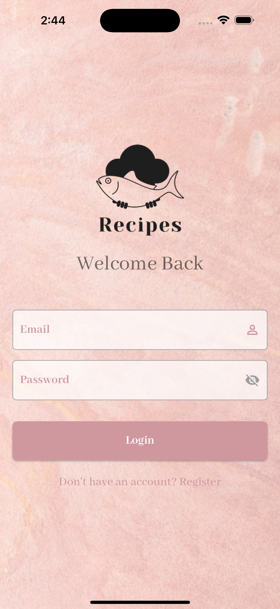               | 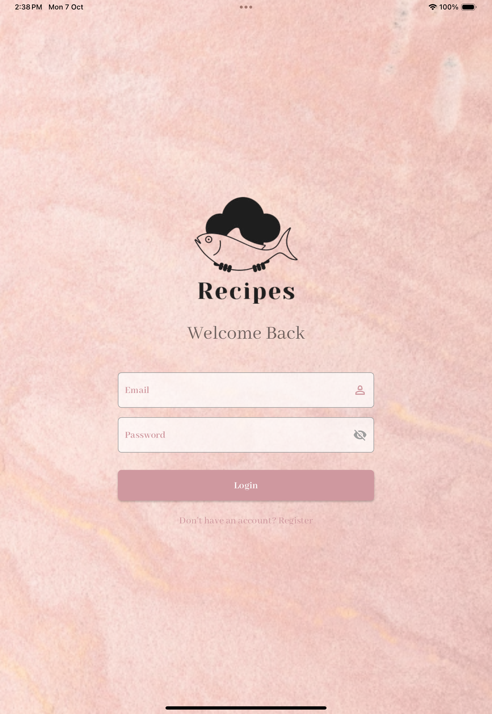               |
| Registration Screen | 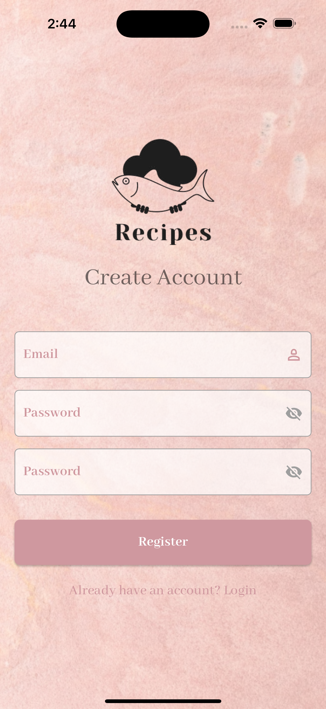 | 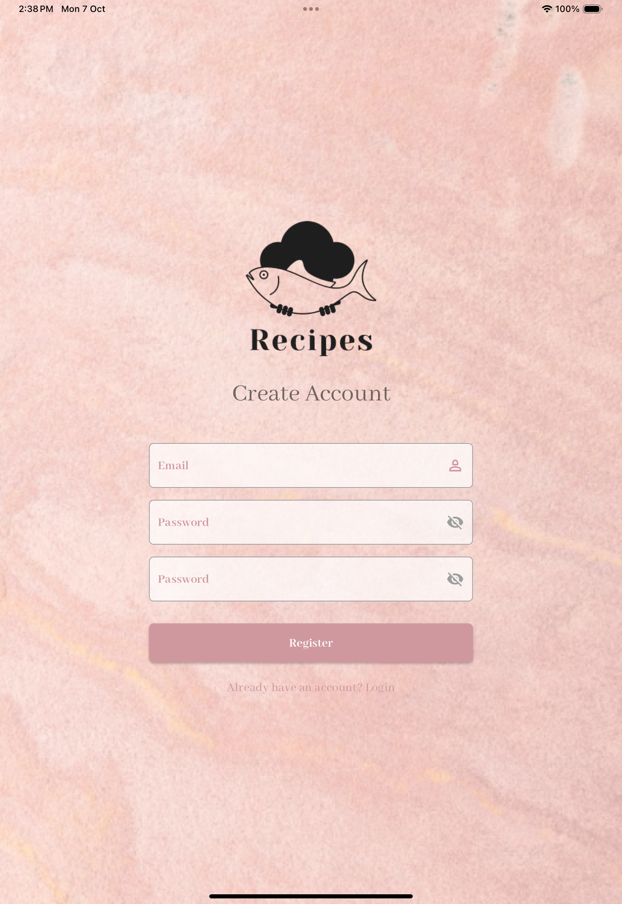 |

### Recipe Browsing

| Feature             | Screenshot Phone                                            | Screenshot tablet                                                  |
| ------------------- | ----------------------------------------------------------- | ------------------------------------------------------------------ |
| Recipe List         |            |             |
| Recipe Search       | 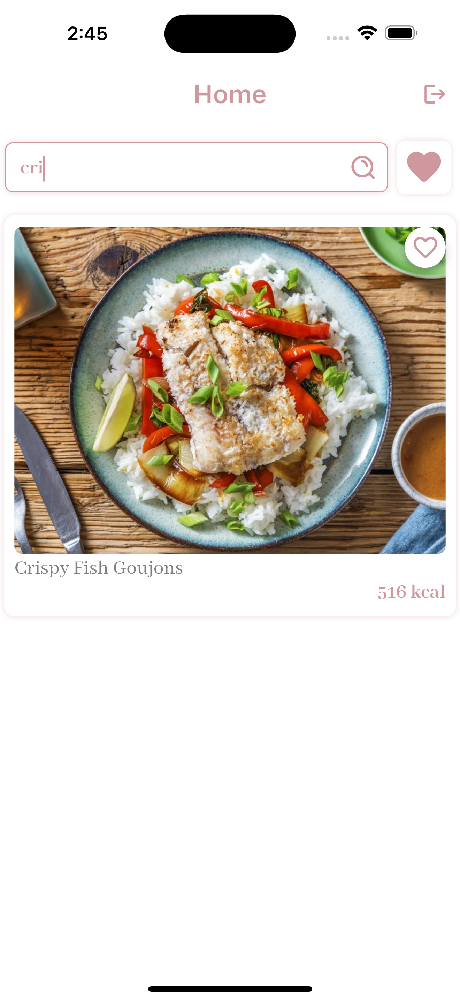       | 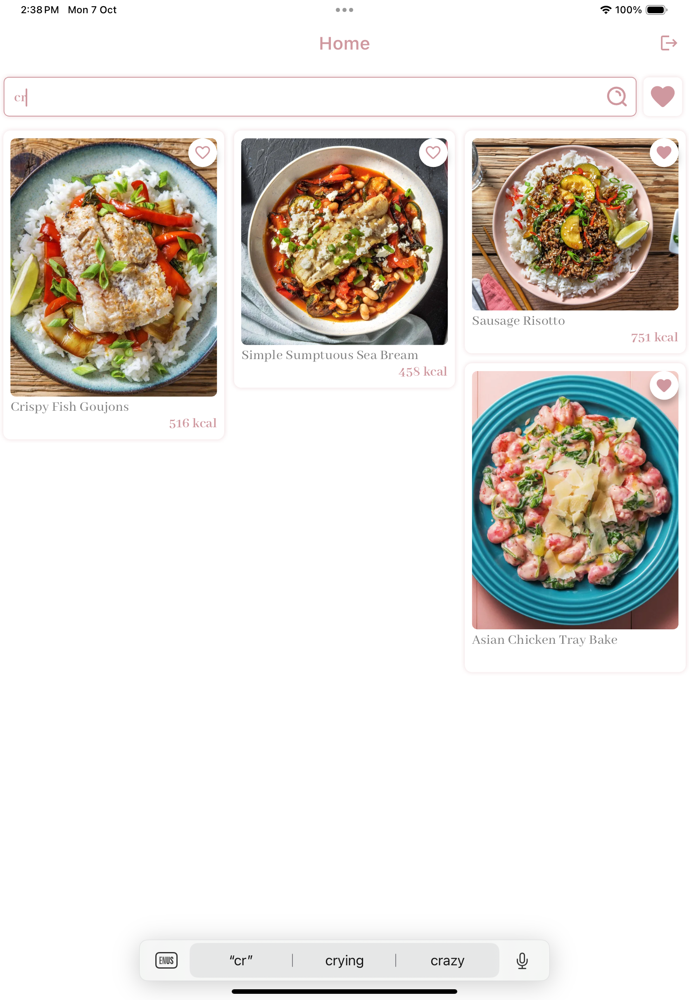        |
| Recipe Search Empty | 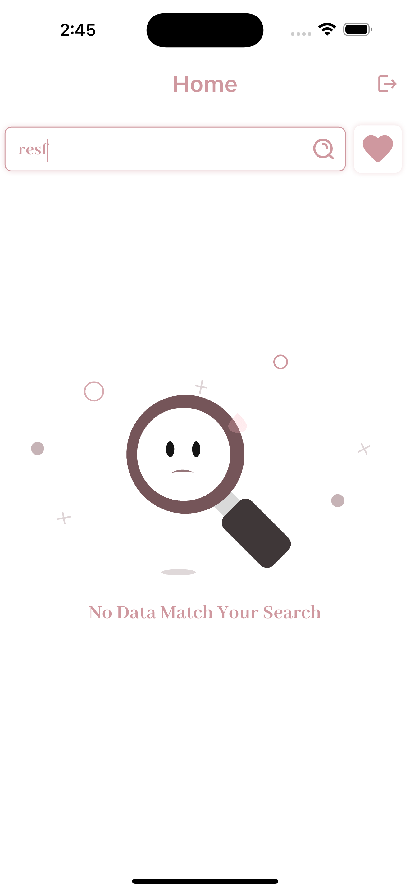 |  |

### Recipe Details

| Feature                    | Screenshot Phone                                        | Screenshot tablet                                             |
| -------------------------- | ------------------------------------------------------- | ------------------------------------------------------------- |
| Viewing Recipe Information | 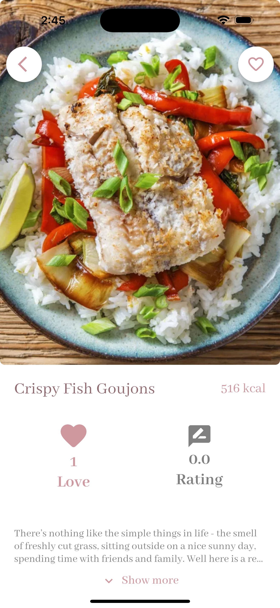 | 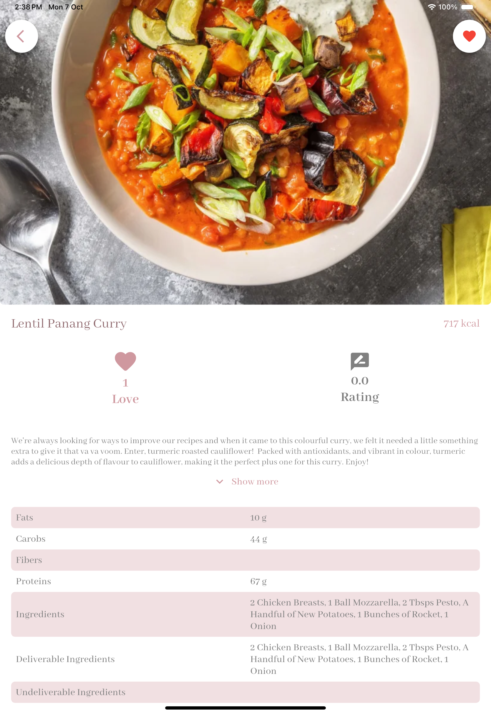 |
| Favorites                  | 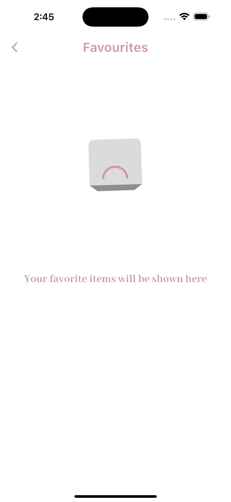           | 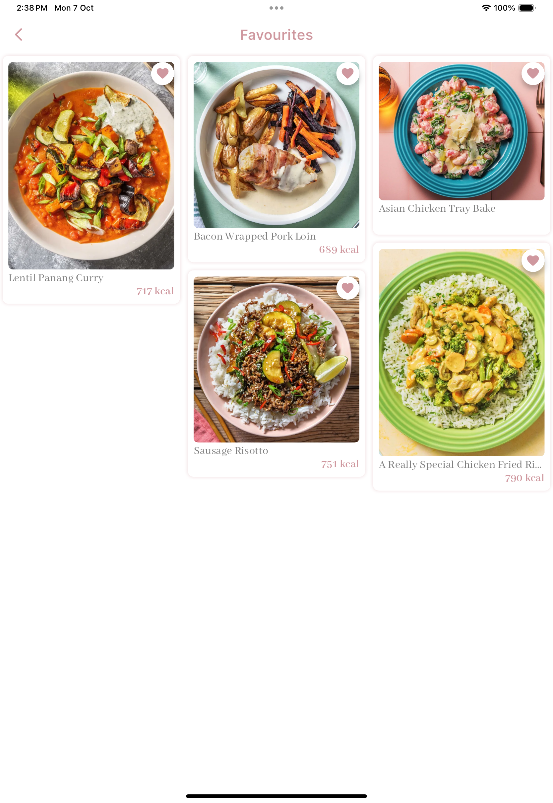           |

## Animations <a name = "animations"></a>

The app features a variety of animations to enhance the user experience, including:

- **Heart Animation:** A heart animation appears when a user adds a recipe to their favorites.
- **Scale Animation:** The favorite button scales up and down when tapped.
- **Size and Color Animation:** The favorite button changes size and color to indicate whether a recipe is favorited.
- **Other Animations:** The app incorporates other subtle animations for a more engaging and polished feel.

## Libraries Used <a name = "libraries-used"></a>

- **Flutter:** Cross-platform mobile framework.
- **Flutter Bloc:** State management solution.
- **Dio:** Network calling
- **Go Router:** Navigation and routing.
- **Cached Network Image:** Efficient image loading and caching.
- **Flutter ScreenUtil:** Responsive UI design.
- **Skeletonizer:** Placeholder loading animations.
- **flutter_native_splash:** Provides a native splash screen for Android and iOS.
- **Other libraries:** Refer to pubspec.yaml for a complete list.

## Connectivity Handling <a name = "connectivity-handling"></a>

This app includes features to handle internet connectivity changes:

- **Connectivity Checks:** The app actively monitors the device's internet connection status.
- **User Notifications:** Users are notified if the internet connection is lost.
- **Reconnect Assistance:** The app provides options for users to re-enable their internet connection or retry network requests.
